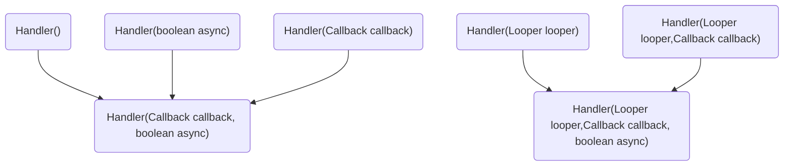
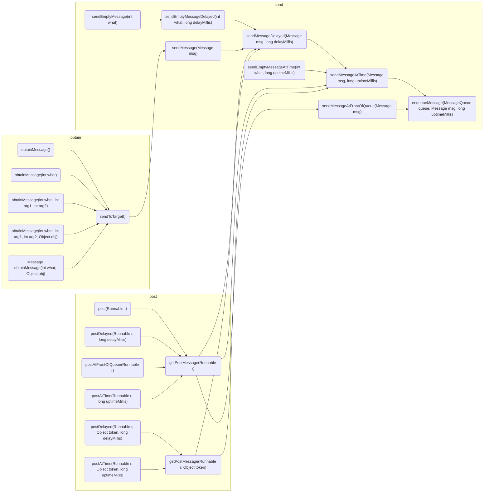
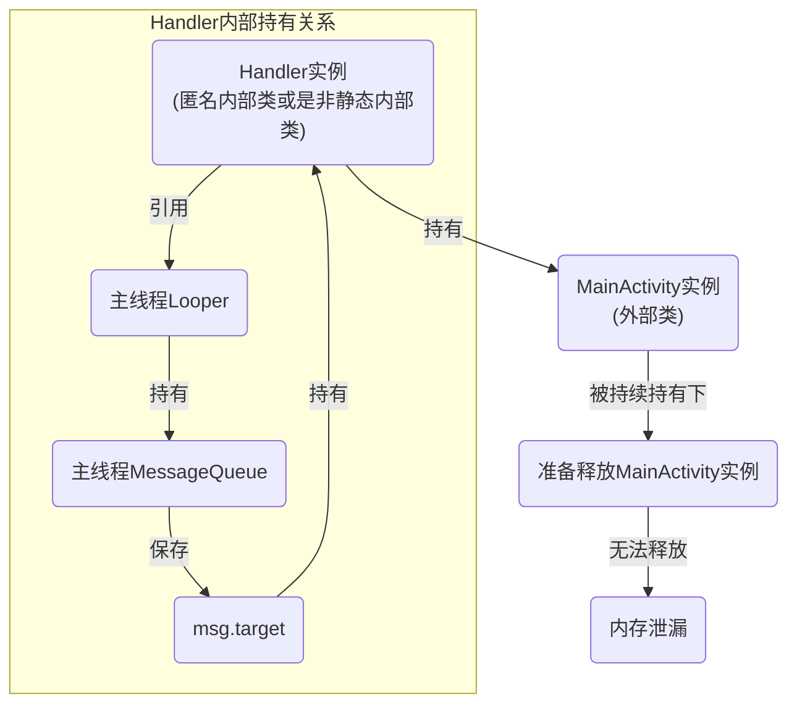

## 1. Handler相关类总结
1. Handler ：用于发送和接收消息,是最外层的入口
2. Message：消息实体,实现了Parcelable接口,内部实现了单链表
3. [Looper](https://kkyflying.github.io/posts/Loop/) ：用于轮询消息队列，一个线程只有一个Looper
4. [MessageQueue](https://kkyflying.github.io/posts/MessageQueue/)：消息队列，用于存储消息和管理消息
5. [ThreadLocal](https://kkyflying.github.io/posts/ThreadLocal/) : 提供线程本地变量的存储

在把上述的5个类都分析一遍后,可以发现重点逻辑都在MessageQueue,Looper,ThreadLocal则是实现功能的基础,Handler仅仅只是一个最外层的入口而已,并没有太多的重要的逻辑

## 2. Handler构造方法


虽然handler的构造方法很多,但是经过整理发现,真正调用到的就仅有两个而已

```java
public Handler(@Nullable Callback callback, boolean async) {
	if (FIND_POTENTIAL_LEAKS) {	
        final Class<? extends Handler> klass = getClass();
        if ((klass.isAnonymousClass() || klass.isMemberClass() || klass.isLocalClass()) &&
                    (klass.getModifiers() & Modifier.STATIC) == 0) {
          	Log.w(TAG, "The following Handler class should be static or leaks might occur: " +
                    klass.getCanonicalName());
         }
     }

	mLooper = Looper.myLooper();
	if (mLooper == null) {
            throw new RuntimeException(
                "Can't create handler inside thread " + Thread.currentThread()
                        + " that has not called Looper.prepare()");
    }
    mQueue = mLooper.mQueue;
    mCallback = callback;
    mAsynchronous = async;
}
```
该构造中因为没有传入Looper，所以要从Looper中的ThreadLocal静态常量中获取获取当前线程的Looper（ThreadLocal中的ThreadLocalMap保存着Looper），如果当前线程没有Looper，或者说当前线程的Looper没有prepare，则直接抛出异常。

```java
public Handler(@NonNull Looper looper, @Nullable Callback callback, boolean async) {
	mLooper = looper;
	mQueue = looper.mQueue;
	mCallback = callback;
	mAsynchronous = async;
}
```
## 3. Handler发送任务的方法

通过上述流程图的总结,可以把发送任务的方法分为send;post;obtain三类方法
1. obtain类方法其实就是先构造Message,并通过sendMessage发送出去
2. post类方法先通过getPostMessage方法把Runnable构建到Message里,再通过send类方法发送任务
3. send类方法在调用的过程中也是构造Message,最后调用enqueueMessage,把msg加入MessageQueue

所以其实可以忽略这些发送方法,分析enqueueMessage即可,而在这个方法里实际上调用了[MessageQueue中的enqueueMessage](https://kkyflying.github.io/posts/MessageQueue/#3-%E6%8F%92%E5%85%A5%E6%93%8D%E4%BD%9C-enqueuemessage)
```java
private boolean enqueueMessage(MessageQueue queue, Message msg, long uptimeMillis) {
    msg.target = this;
    if (mAsynchronous) {
        msg.setAsynchronous(true);
    }
    return queue.enqueueMessage(msg, uptimeMillis);
    }
```

## 4. Handler回调分析
```java
 public interface Callback {
        /**
         * @param msg A {@link android.os.Message Message} object
         * @return True if no further handling is desired
         */
        public boolean handleMessage(Message msg);
    }
    
    /**
     * Subclasses must implement this to receive messages.
     */
    public void handleMessage(Message msg) {
    }
    
    /**
     * Handle system messages here.
     */
    public void dispatchMessage(Message msg) {
        if (msg.callback != null) {
            handleCallback(msg);
        } else {
            if (mCallback != null) {
                if (mCallback.handleMessage(msg)) {
                    return;
                }
            }
            handleMessage(msg);
        }
    }
```
1. Callback接口是在Handler构造方法时传入的
2. ```handleMessage(Message msg)```就是使用handler时重写处理msg的方法,在这里添加上需要处理的任务
2. ```dispatchMessage(Message msg)```方法则是在[Looper.loop()](https://kkyflying.github.io/posts/Loop/#5-looperloop)被调用
4. 在```dispatchMessage(Message msg)```逻辑里,先判断msg里的callback是否为空,不为空则调用callback,这里的callback实际类型为Runnable,就是在post类方法里传入的;而mCallback则是在handler的构造方法里传入,如果传入了mCallback,handleMessage(Message msg)则不会调用


## 5. runWithScissors
Handler中有一个静态内部类BlockingRunnable
```java
public final boolean runWithScissors()(final Runnable r, long timeout) {
    //注释1
    if (r == null) {
        throw new IllegalArgumentException("runnable must not be null");
    }
    if (timeout < 0) {
        throw new IllegalArgumentException("timeout must be non-negative");
    }
    //注释3
    if (Looper.myLooper() == mLooper) {
        r.run();
        return true;
    }
    BlockingRunnable br = new BlockingRunnable(r);
    return br.postAndWait(this, timeout);
    }

private static final class BlockingRunnable implements Runnable {
        private final Runnable mTask;
        private boolean mDone;

        public BlockingRunnable(Runnable task) {
            mTask = task;
        }

        @Override
        public void run() {
            //注释3
            try {
                mTask.run();
            } finally {
                synchronized (this) {
                    mDone = true;
                    notifyAll();
                }
            }
        }
        
        public boolean postAndWait(Handler handler, long timeout) {
            if (!handler.post(this)) {
                return false;
            }

            synchronized (this) {
                if (timeout > 0) {
                    final long expirationTime = SystemClock.uptimeMillis() + timeout;
                    while (!mDone) {
                        long delay = expirationTime - SystemClock.uptimeMillis();
                        if (delay <= 0) {
                            return false; // timeout
                        }
                        try {
                            wait(delay);//限时等待
                        } catch (InterruptedException ex) {
                        }
                    }
                } else {
                    while (!mDone) {
                        try {
                            wait(); //无限期等待
                        } catch (InterruptedException ex) {
                        }
                    }
                }
            }
            return true;
        }
    }
```
### 4.1 runWithScissors作用
此方法可以实现,在**子线程**中通过Handler向**主线程**中发送一个任务,并要等**主线程**处理完成此任务后,**子线程**才能继续执行任务

### 4.2 runWithScissors分析
1. 注释1: 先判断传入的runnable和timeout的校验
2. 注释2: Looper.myLooper()获得当前线程下的looper,和调用的handler里的looper对比是否相同,就可以判断当前线程是否和Handler处理的线程是否一致,如果一致则直接运行run();
3. 线程不一致的情况下,则把runnable和timeout传入BlockingRunnable中

### 4.3 BlockingRunnable分析
1. 注释3: run中执行了从runWithScissors传递过来的runnable,并在执行完成后,设置mDone标志位为true,notifyAll()并唤醒线程
2. postAndWait方法里,通过post把任务发出去,并设置timeout,在这个方法中,只有两种返回false的情况:
   3.1 handler的post失败,可能是Looper挂掉了
   3.2 等待timeout超时,任务还没结束
3. 子线程在调用runWithScissors后则是在postAndWait中阻塞,等待任务的完成,根据返回值来判断任务是否完成
 

### 4.4 runWithScissors()的隐患
看似一个很不错的方法,但此方法仍是被@hide标注,说明并不想让应用层app开发者所调用,那么其中应该还是有一些问题的
#### 4.4.1 如果timeout超时了
假设设置timeout为2秒,在2秒过后,那么等待超时返回false,子线程唤醒会后根据返回值false来继续完成任务,可是此时,之前通过handler发送的任务依旧还在MessageQueue里,并没有被移除,等待Looper取出,最后还是会在主线程中调用,那么何时完成就变得不可控了,会发生什么事情就变得不可预估了
#### 4.4.2 出现死锁的可能
1. 假设子线程中持有别的锁,这个时候子线程若是等不到唤醒,那么就有可能造成了死锁
2. 一般来说通过handler发送任务加入到MessageQueue里,最后都会被Looper取出执行,但是如果调用了quit()退出时候,会清理掉所有任务,那么这个子线程则永远得不到唤醒了
3. 因此在使用runWithScissors的时候,要么保证调用的handler所在在线程不退出,Looper不退出,例如发送主线程就不会退出,要么退出要调用quitSafely()
4. 因为quit()退出会清除掉所有的在MessageQueue里的任务,而quitSafely()只会清除在(p.when > now)当前时间点之后的消息

在java中，非静态内部类 & 匿名内部类 都默认持有外部类的引用


## 5. 异步消息和同步屏障
1. 其实单纯的发一个异步消息其实没啥意义,一样按照同步消息一样的规则进队,只要加入同步屏障后,才能优先执行异步消息


## 6. Handler内存泄漏

### 6.1 原因分析
```java
public class MainActivity extends AppCompatActivity {
    
    //匿名内部类
    private Handler handler1 = new Handler(){
        @Override
        public void handleMessage(@NonNull Message msg) {
            switch (msg.what){
                case 1:
                    break;
                default:
                    super.handleMessage(msg);
                    break;
            }
        }
    };
    
    //非静态内部类
    private class MyHandler extends Handler{
        @Override
        public void handleMessage(@NonNull Message msg) {
            switch (msg.what){
                case 1:
                    break;
                default:
                    super.handleMessage(msg);
                    break;
            }
        }
    }
    
}    
```
1. 主线程Looper的生命周期和整个应用进程一致,只有当应用进程退出的时候,主线程Looper才会退出,而Looper中又持有着MessageQueue
2. 在以上两种方式来实现handler下,因为匿名内部类和非静态内部类都默认持有外部类的引用,那handler在使用上述的两种方式的情况下,就会持有了外部的MainActivity了
3. 当MainActivity退出的时候,如果主线程下的MessageQueue还有未处理或者正在处理的msg,那msg就会持有handler,而handler又持有着MainActivity


### 6.2 解决方案

```java
public class MainActivity extends AppCompatActivity {

    private static  class MyHandler extends Handler{
        private WeakReference<Activity> reference;
        
        public MyHandler(Activity reference){
            super(Looper.getMainLooper());
            this.reference = new WeakReference<>(reference);
        }

        @Override
        public void handleMessage(@NonNull Message msg) {
            switch (msg.what){
                case 1:
                    break;
                default:
                    super.handleMessage(msg);
            }
        }
    }
    
    private MyHandler myHandler;
    
    @Override
    protected void onCreate(Bundle savedInstanceState) {
        super.onCreate(savedInstanceState);
        setContentView(R.layout.activity_main);
        myHandler = new MyHandler(this);
    }
    
    @Override
    protected void onDestroy() {
        super.onDestroy();
        myHandler.removeCallbacksAndMessages(null);
    }
    
```
1. 这静态内部类不持有外部类,使得handler不再持有MainActivity
2. 使用WeakReference弱引用来持有外部类,保证外部类可以被回收
3. 在MainActivity的生命周期结束onDestroy下清空handler中的msg
